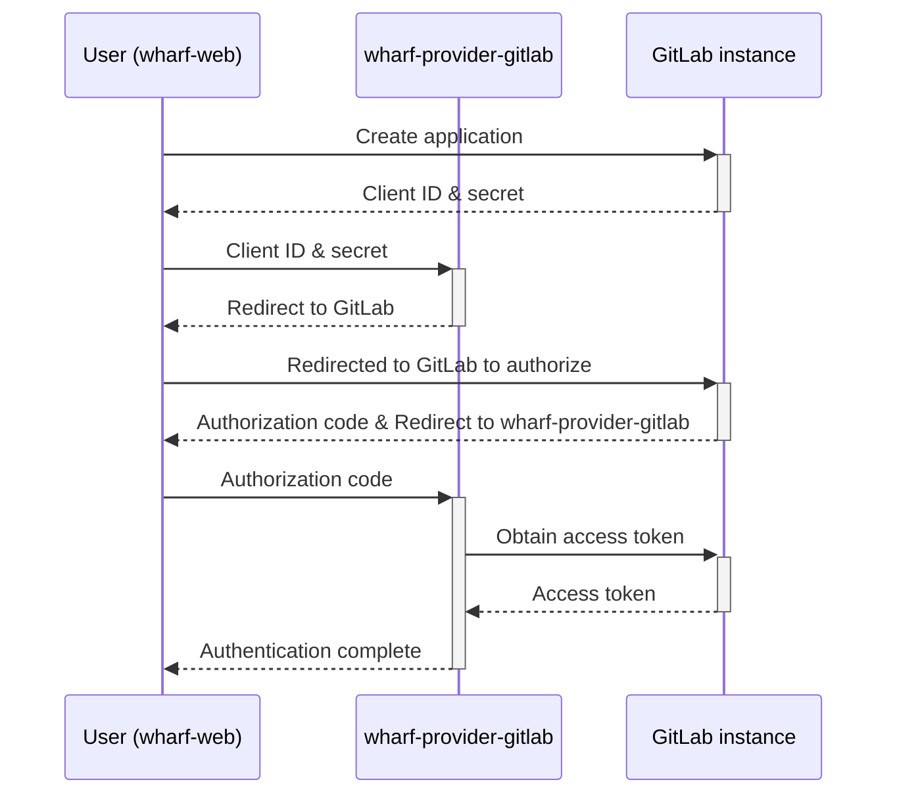

# Authenticating providers

## Old solution

Basic auth using personal access token (PAT) or username+password from some
user.

This is insecure because the same credentials are used over and over again, and
it should at least be possible for token rotation such as with GitHub Apps
that uses private keys and 1h lifetimed installation tokens.

Backward compatability is vital here. Basic auth should still be possible, while
heavily discouraged, given that we have an alternative and more secure solution.

## New solution

### GitHub

> TODO: Consider auth flow for GitHub Apps, how to allow for this in a generic
> manner, so the wharf-api doesn't have to know about this auth flow? Or do we
> add this into wharf-api as this follows the OAuth 2.0 code flow?

1. Forward user to [create a new GitHub App from a generated manifest.](https://docs.github.com/en/developers/apps/building-github-apps/creating-a-github-app-from-a-manifest)

2. Users are redirected back to Wharf with a OTP token

3. wharf-provider-github uses token to obtain private key and app ID

4. wharf-api stores private key and app ID in DB

5. On each request to the wharf-provider-github, the wharf-api populates the
   credentials with the private key and app ID, that the wharf-provider-github
   can use to generate the JWT and obtain the installation tokens.

### GitLab

> TODO: Consider auth flow for GitLab

Supports a variety of OAuth 2.0 flows, listed in order from recommended to
discouraged:

- Authorization code with Proof Key for Code Exchange
- Authorization code
- Implicit grant
- Resource owner password credentials

Here's how the "Authorization code" flow works for GitLab:



1. Create application at `https://{instance}/-/profile/applications`

   Later found at `https://{instance}/oauth/applications/{number}`

2. Request access from URL:

   ```
   GET https://{instance}/oauth/authorize?client_id=...&redirect_uri=...&response_type=code&state=...&scope=...
   ```
   
3. User gets redirected to the `redirect_uri` with the query parameters:

   ```
   GET {redirect_uri}?code=...&state=...
   ```
   
4. The server requests access token by issuing:

   ```
   POST https://{instance}/oauth/token
   FORM VALUES:
    client_id=...
    &client_secret=...
    &grant_type=authorization_code
    &redirect_uri=...
   ```
   
5. GitLab server responds:

   ```json
   {
     "access_token": "de6780bc506a0446309bd9362820ba8aed28aa506c71eedbe1c5c4f9dd350e54",
     "token_type": "bearer",
     "expires_in": 7200,
     "refresh_token": "8257e65c97202ed1726cf9571600918f3bffb2544b26e00a61df9897668c33a1",
     "created_at": 1607635748
   }
   ```

Docs: <https://docs.gitlab.com/ee/api/oauth2.html>

### Azure DevOps

> TODO: Consider auth flow for Azure DevOps

- OAuth guide: <https://docs.microsoft.com/en-us/azure/devops/integrate/get-started/authentication/oauth?view=azure-devops>
- OAuth example: <https://github.com/microsoft/azure-devops-auth-samples/tree/master/OAuthWebSample>
- Auth guidance: <https://docs.microsoft.com/en-us/azure/devops/integrate/get-started/authentication/authentication-guidance?view=azure-devops>

### Gitea

> TODO: Consider auth flow for Gitea

- Seems to be regular OAuth 2 code flow, same as for GitHub but without the
  "GitHub Apps manifest" so users has to create the applications themselves:
  <https://docs.gitea.io/en-us/oauth2-provider/>
