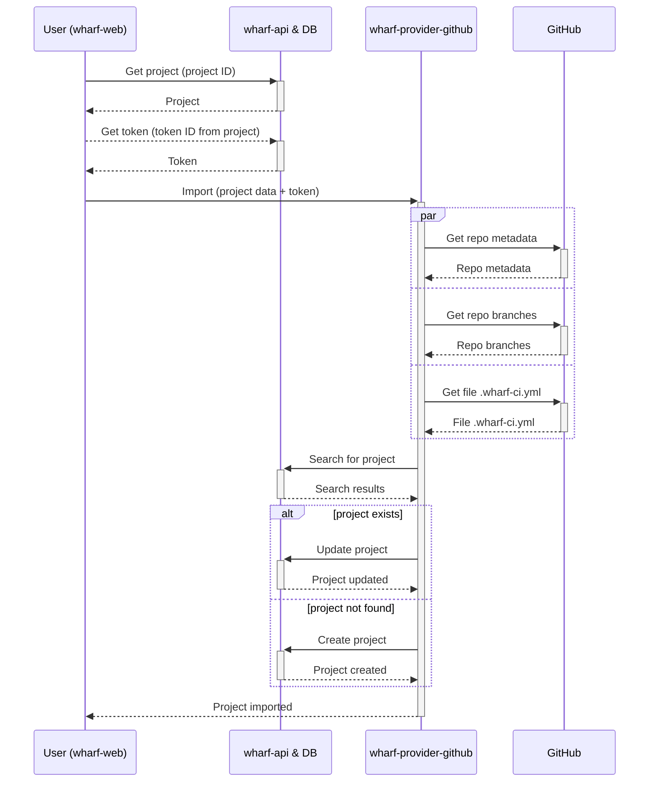
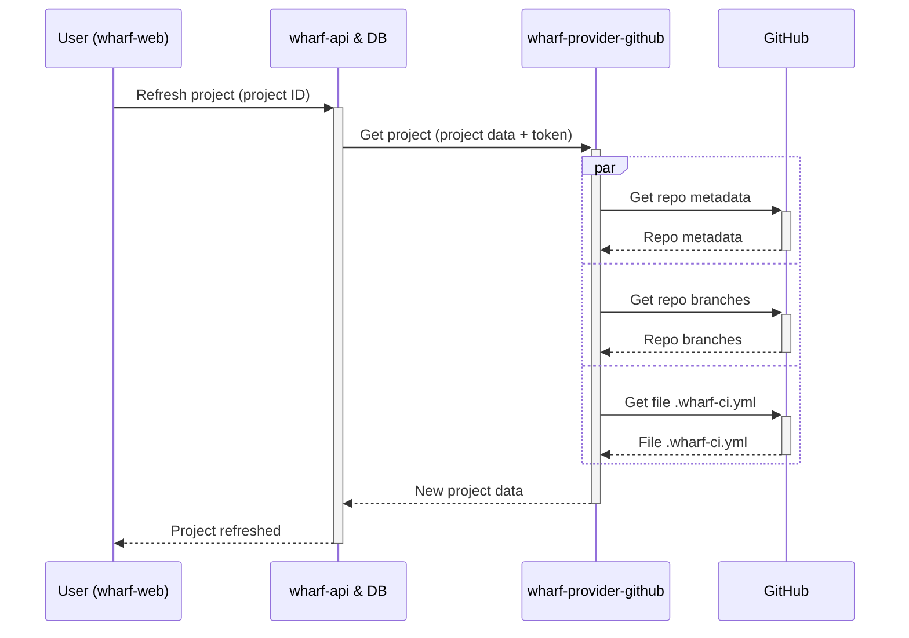

# Refreshing project

## Old solution

Given user knows the project ID:

```mermaid
sequenceDiagram
    participant user as User (wharf-web)
    participant api as wharf-api & DB
    participant prov as wharf-provider-github
    participant gh as GitHub

    user ->> +api: Get project (project ID)
    api -->> -user: Project

    user -->> +api: Get token (token ID from project)
    api -->> -user: Token
    
    user ->> +prov: Import (project data + token)
    par
        prov ->> +gh: Get repo metadata
        gh -->> -prov: Repo metadata
    and
        prov ->> +gh: Get repo branches
        gh -->> -prov: Repo branches
    and
        prov ->> +gh: Get file .wharf-ci.yml
        gh -->> -prov: File .wharf-ci.yml
    end

    prov ->> +api: Search for project
    api -->> -prov: Search results

    alt project exists
        prov ->> +api: Update project
        api -->> -prov: Project updated
    else project not found
        prov ->> +api: Create project
        api -->> -prov: Project created
    end

    prov -->> -user: Project imported
```

## New solution

Given user knows the project ID:

```mermaid
sequenceDiagram
    participant user as User (wharf-web)
    participant api as wharf-api & DB
    participant prov as wharf-provider-github
    participant gh as GitHub
    
    user ->> +api: Refresh project (project ID)
    api ->> +prov: Get project (project data + token)

    par
        prov ->> +gh: Get repo metadata
        gh -->> -prov: Repo metadata
    and
        prov ->> +gh: Get repo branches
        gh -->> -prov: Repo branches
    and
        prov ->> +gh: Get file .wharf-ci.yml
        gh -->> -prov: File .wharf-ci.yml
    end
    
    prov -->> -api: New project data
    api -->> -user: Project refreshed
```
